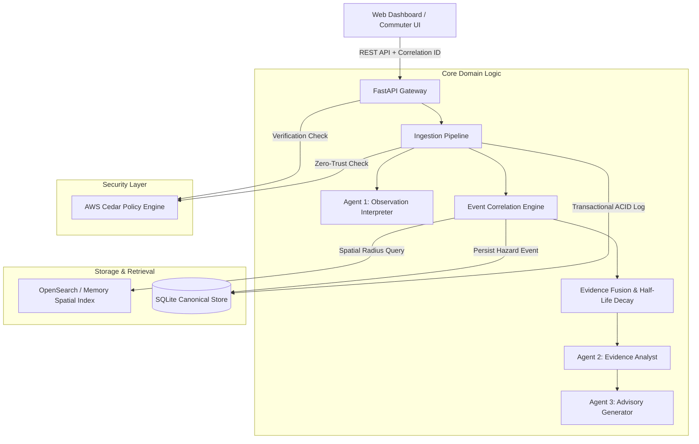

# NammaSignal

> **Unified, time-aware, evidence-backed road hazard intelligence for Bengaluru.**

Built for the **First Commit | Bharat Builds Tour | WeMakeDevs** hackathon (**Build It Track** & **Best UI Track**).

---

## 1. The Core Problem

During heavy monsoon rainfall in Bengaluru, arterial roads (Outer Ring Road, Silk Board, Bellandur, Hebbal, Windsor Manor, Majestic underpasses) become submerged within 15–30 minutes of cloudburst activity.

Information about these hazards exists in fragments across multiple disconnected channels:
* **Official disaster-monitoring systems** (KSNDMC automated rain gauges and weather radar)
* **Traffic police advisories** (Disseminated via social media broadcasts)
* **Civic complaint systems** (Ticketing portals like BBMP Sahaaya)
* **Citizen observations** (Crowdsourced text messages, photos, and WhatsApp groups)
* **Historical hotspot records**

These sources differ vastly in authority, freshness, reliability, geographic precision, and semantics. 

Existing systems perform vital individual functions, but **none provide a unified intelligence feed**. A commuter does not merely need to know whether someone reported waterlogging 3 hours ago; they need to know:
> *"Is there sufficiently fresh, corroborated, and authoritative evidence that this specific road corridor is hazardous right now, how confident is the system, and why?"*

---

## 2. Why Existing Systems Don't Solve This

Our research into official Karnataka and Bengaluru public channels revealed crucial systemic gaps:

| System / Channel | Agency / Source | Public Streaming API? | Primary Limitation |
| :--- | :--- | :--- | :--- |
| **Varunamitra** | KSNDMC | ❌ **No public API** | Macro-level rainfall sensor pulses (15-min intervals); lacks road-level inundation observations. |
| **Bengaluru Megha Sandesha** | KSNDMC / IISc | ❌ **No public API** | Ward-level alerts (243 wards); cannot pinpoint whether a specific railway underpass is impassable. |
| **BBMP Sahaaya 2.0** | BBMP / GBA | ❌ **No public stream** | Grievance ticketing workflow (24–72 hr SLA); completely unsuitable for rapid transit decisions. |
| **Bengaluru Traffic Police** | BTP Social Media | ❌ **No structured feed** | Highly authoritative, but unstructured text tweets/broadcasts without machine-readable coordinates or clearance signals. |
| **Citizen Crowdsourcing** | Social Media / Chat | ❌ Unverified noise | Immediate ground truth, but prone to viral amplification of stale/outdated flood photos without verification. |

### Our Architectural Stance:
NammaSignal does **not** replace these systems. It operates as an **intelligence and fusion layer** above them. 
> **Honest Simulation Principle**: Because official real-time APIs are not open to the public, NammaSignal implements an explicit `ExternalSourceAdapter` pattern with clearly labeled `[SIMULATED]` demo providers. We **never** fabricate or claim live government API connectivity where none exists.

---

## 3. Product Concept: Evidence Fusion

NammaSignal distinguishes strictly between three concepts:

1. **Observation**: An immutable atomic piece of ground evidence (e.g. a citizen text report, an authenticated photo, a traffic police bulletin, or a sensor pulse).
2. **Hazard Event**: A spatial-temporal-semantic cluster of observations correlated to the same real-world incident.
3. **Assessment**: The system's current time-decayed evaluation of risk, evidence confidence, and commuter guidance.

```text
Report A: "Water is knee deep near Silk Board underpass."
Report B: "Vehicles are turning around at the underpass."
Report C: Photo showing water accumulation.
Report D: Official BTP traffic advisory.
                ↓
    Spatial + Temporal Correlation (OpenSearch & Gazetteer)
                ↓
    AWS Strands Multi-Agent Interpretation & Contradiction Check
                ↓
    Deterministic Half-Life Time Decay & Evidence Fusion
                ↓
    AWS Cedar Policy Engine Authorization Check
                ↓
          HAZARD EVENT: Silk Board Underpass
          Risk Level:          HIGH
          Evidence Confidence: HIGH (Score: 0.68)
          Freshness Status:    FRESH (Last evidence: 4m ago)
          Ground Evidence:     4 observations (1 photo, 1 officer, 2 citizens)
```

---

## 4. Architectural Overview

NammaSignal is built following **Clean / Hexagonal Architecture** (Ports and Adapters):



---

## 5. AWS Open-Source Technologies Used

### A. AWS Cedar Policy Engine (`cedarpy`)
* **Role**: Fine-grained, zero-trust authorization as code.
* **Why**: Prevents untrusted actors from modifying hazard statuses or publishing official alerts. Enforces server-side **deny-by-default**.
* **Policies**:
  - `Citizen`: Can submit observations and view public hazard assessments. Explicitly forbidden from verifying or dismissing hazards.
  - `VerifiedResponder` (Traffic Police, BBMP Engineers): Can verify hazard status, inspect detailed evidence, and submit clearance reports.
  - `OfficialAuthority` (Control Room): Full operational override and simulation management.

### B. AWS Strands Agents SDK (`strands-agents`)
* **Role**: Model-driven multi-agent harness with strict boundaries.
* **Why**: Translates messy Bengaluru vernacular/slang into structured entities without giving LLMs arbitrary write permissions.
  - **Agent 1 (Observation Interpreter)**: Extracts hazard type, reported severity, and coordinates using the Bengaluru landmark gazetteer. Neutralizes prompt injection attempts.
  - **Agent 2 (Evidence Analyst)**: Detects duplicate reports, flags conflicting observations ("water drained" vs "knee deep"), and tracks confidence trajectories.
  - **Agent 3 (Advisory Generator)**: Constructs concise, evidence-grounded commuter bulletins citing exact evidence counts and timestamps.

### C. OpenSearch (Geospatial & Semantic Cluster)
* **Role**: Spatial bounding queries (`geo_point`), temporal filtering, and event indexing.
* **Resilience**: Includes a zero-dependency in-memory spatial index fallback (`MemorySpatialIndex`) so the entire application runs effortlessly even without Docker.

---

## 6. Mathematical Foundations

### 6.1 Exponential Half-Life Time Decay
The evidence weight $w_{\text{time}}$ of observation $i$ decays exponentially based on its age $\Delta t$:
$$w_{\text{time}}(i) = 2^{-\frac{\Delta t_i}{\tau_h}}$$
* Waterlogging half-life: $\tau = 30 \text{ minutes}$
* Fallen tree / road blockage half-life: $\tau = 180 \text{ minutes}$
* Pothole / structural damage half-life: $\tau = 4320 \text{ minutes (3 days)}$

Observations older than $4\tau$ decay to $< 6.25\%$ weight and are marked `STALE`.

### 6.2 Multi-Source Corroboration & Calibrated Confidence
Individual evidence weight combines source trust, time recency, and reported severity:
$$W_{\text{effective}} = W_{\text{src}} \times W_{\text{time}} \times W_{\text{severity}}$$
* Official Authority: $W_{\text{src}} = 1.00$
* Verified Field Responder: $W_{\text{src}} = 0.90$
* Photo / Visual Proof Bonus: $+0.25$
* Citizen Report: $W_{\text{src}} = 0.50$

Confidence is calculated via non-linear corroboration across independent reporting principals and mapped to calibrated tiers (`LOW`, `MEDIUM`, `HIGH`, `VERY_HIGH`), rather than uncalibrated pseudo-probabilities.

---

## 7. Quickstart Guide (Run Locally in 1 Command)

### Prerequisites
* Python 3.10+ (tested on Python 3.13)
* Node.js (optional, web UI is served directly via FastAPI)

### One-Command Startup
Clone the repository and run:
```powershell
# Windows PowerShell
.\run_dev.ps1

# Or standard terminal:
python -m uvicorn apps.api.main:app --host 0.0.0.0 --port 8000 --reload
```

Open your browser at:
👉 **`http://localhost:8000`** (Interactive Command Center UI)
👉 **`http://localhost:8000/docs`** (Interactive OpenAPI / Swagger Documentation)

---

## 8. Running the Automated Test Suite

NammaSignal features a comprehensive automated test suite covering unit math, Cedar policies, integration lifecycles, and adversarial security:

```powershell
# Windows PowerShell
.\run_tests.ps1

# Or directly with pytest:
python -m pytest tests/ -v
```

### Test Coverage (22 / 22 Passing):
* **Unit Tests (`tests/unit/test_domain_math.py`)**: Exact 30-min half-life verification, Haversine spatial distance, multi-source corroboration increase, and clearance cancellation.
* **Strands Agent Tests (`tests/unit/test_agents.py`)**: Bengaluru slang parsing ("knee deep near silk board"), adversarial prompt injection neutralization, and evidence analysis.
* **AWS Cedar Policy Tests (`tests/authorization/test_cedar_policies.py`)**: Complete RBAC test matrix, Citizen submission allowance, Citizen verification rejection, Responder permissions, and System least-privilege.
* **Integration Lifecycle Tests (`tests/integration/test_api_pipeline.py`)**: Full lifecycle: Citizen report -> Photo attach -> Unauthorized verification (403 Forbidden) -> Authorized verification (200 OK) -> Time decay -> Road clearance resolution.
* **Adversarial Security Tests (`tests/adversarial/test_adversarial.py`)**: Prompt injection attempts, empty text payloads, invalid latitude/longitude boundaries, and oversized payloads.

---

## 9. Running the Interactive Simulation

To demonstrate the full intelligence loop directly in the terminal without opening a browser:

```powershell
python scripts/demo_simulation.py
```

### 5-Step Simulation Output:
1. **Step 1: Isolated Citizen Observation** &rarr; Risk: `UNCERTAIN`, Conf: `LOW` (Score: 0.09)
2. **Step 2: Multi-Source Corroboration + Photo Evidence** &rarr; Risk: `ELEVATED`, Conf: `HIGH` (Score: 0.41)
3. **Step 3: Official Verification (AWS Cedar)** &rarr; Cedar: `ALLOW`, Status: `VERIFIED`, Risk: `HIGH` (Score: 0.68)
4. **Step 4: Time Decay in Action (+75m)** &rarr; Freshness: `AGING (75m ago)`, Score decays to 0.31
5. **Step 5: Road Clearance & Hazard Resolution** &rarr; Assessment flips to `CLEARED`, informing commuters the road is safe!

---

## 10. Security & Threat Model Summary

* **Untrusted LLM Guardrails**: LLMs *never* have direct database mutation privileges. Structured outputs pass Pydantic v2 schemas before ingestion.
* **Prompt Injection Defense**: Input text is scanned and neutralized before agent processing. Adversarial instructions cannot alter hazard state or elevate privileges.
* **Zero-Trust Authorization**: Enforced on the server side using the native Rust-backed AWS Cedar policy engine (`cedarpy`).
* **Sybil Attack Resistance**: Hard confidence cap on uncorroborated reports; requires multi-principal corroboration or verified responder credentials to escalate to High risk.

---

## 11. Limitations & Future Roadmap

* **Gazetteer Expansion**: Currently covers 11 chronic flood zones across Bengaluru; future versions can integrate OpenStreetMap road corridor graphs.
* **Multilingual Audio/Voice**: Adding WhatsApp Voice Note transcription for auto-rickshaw and delivery driver reporting.
* **Automated Drain Sensor Ingestion**: Real-time IoT ultrasonic water level sensors mounted on storm-water drain culverts.

---

## License
Apache 2.0 &bull; Built with dedication for the **First Commit Hackathon 2026**.
Team **Vertex** &bull; Lochan Gowda T M (@lochangowda10)
